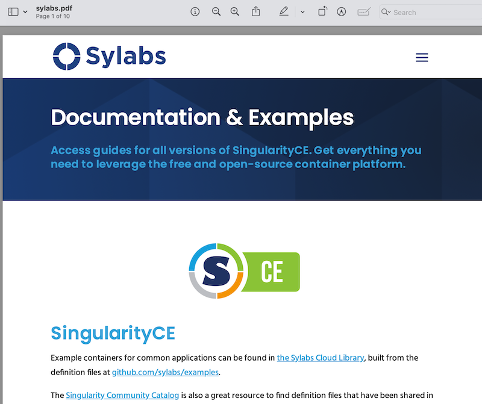

.. _running_services:

############################
Instances - Running Services
############################

{Singularity} is most commonly used to run containers interactively, or in a
batch job, where the container runs in the foreground, performs some work, and
then exits. There are :ref:`different ways <runcontainer>` in which you can run
{Singularity} containers in the foreground. If you use  ``run``, ``exec`` and
``shell`` to interact with processes in the container, then you are running
{Singularity} containers in the foreground.

{Singularity}, also allows you to run containers in a "detached" or "daemon"
mode where the container runs a service. A "service" is essentially a process
running in the background that multiple different clients can use. For example,
a web server or a database. 

A {Singularity} container running a service in the background is called an
*instance*, to distinguish it from the default mode which runs containers in the
foreground.

********
Overview
********

.. _sec:instances:

This page will help you understand instances using an elementary example
followed by a more useful example running an NGINX web server using instances.
At the end, you will find a more detailed example of running an instance of a
service exposing an API that converts URL to PDFs.

To run a service, such as a web server, outside of a container you would
typically install the package for the web server and then instruct systemd
(which manages system services on most Linux distributions) to start it. E.g.

.. code::

   $ sudo yum install nginx
   $ sudo systemctl enable --now nginx

If you were to attempt this in a container, it's likely that it will not work as
expected. You cannot use systemd to run services in a container, by default. It
expects various conditions that are satisfied on the host system, but not inside
containers.

Instead, you should run NGINX in the foreground *inside* the container, but then
run the container in the background, as an *instance*.

************************************
Container Instances in {Singularity}
************************************

To demonstrate the basices of instances, let's use an easy (though somewhat
useless) example, using an Alpine Linux image from the `container library
<https://cloud.sylabs.io/library/>`_:

.. code::

   $ singularity pull library://alpine

The above command will save the alpine image from the Container Library
as ``alpine_latest.sif``.

Starting Instances
==================

To start an instance, you should follow this procedure:

.. code::

   [command]                      [image]              [name of instance]

   $ singularity instance start   alpine_latest.sif     instance1

This command causes {Singularity} to create an isolated environment for the
container services to live inside. It will execute the contents of the
``startscript`` file which can be defined when you build the container via the
def file. You can also use the `instance run` command if you want the container
to execute the ``runscript`` when the instance initiates.

You can confirm that an instance is running by using the ``instance
list`` command:

.. code::

   $ singularity instance list

   INSTANCE NAME    PID      IP              IMAGE
   instance1        22084                    /home/dave/instances/alpine_latest.sif

.. note::

   Instances are linked to the user account that started them. This means that
   if you use ``sudo`` to start an instance as ``root``, you will need to use
   ``sudo`` for all commands managing that instance. ``instance list`` will not
   show instances started by other users.

If you want to run multiple instances from the same image, it’s as
simple as running the command multiple times with different instance
names. The instance name uniquely identify instances, so they cannot be
repeated.

.. code::

   $ singularity instance start alpine_latest.sif instance2

   $ singularity instance start alpine_latest.sif instance3

We now have 3 instances, all using the same image:

.. code::

   $ singularity instance list

   INSTANCE NAME    PID      IP              IMAGE
   instance1        22084                    /home/dave/instances/alpine_latest.sif
   instance2        22443                    /home/dave/instances/alpine_latest.sif
   instance3        22493                    /home/dave/instances/alpine_latest.sif

You can filter the instance list by supplying a pattern:

.. code::

   $ singularity instance list '*2'

   INSTANCE NAME    PID      IP              IMAGE
   instance2        22443                    /home/dave/instances/alpine_latest.s

When an instance is started, it will begin to run the ``%startscript`` from the
container's :ref:`definition file <definition-files>` in the background. If
there is no ``%startscript`` the container will stay idle in the background.

Interacting With Instances
==========================

Although an instance runs its ``%startscript`` (if there is one) in the
background, you can also interact with it in the foreground, by referring to it
with an ``instance://<name>`` URI, where ``<name>`` is replaced with the
instance name.

To run a specific command against an instance, in the foreground, use
``singularity exec``:

.. code::

   $ singularity exec instance://instance1 cat /etc/os-release

Similarly, you can use ``singularity run`` to run the ``%runscript`` for the
container, against a running instance:

.. code::

   $ singularity run instance://instance2

If you want to poke around inside of your instance, you can use the normal
``singularity shell`` command, but give it the instance URI:

.. code::

   $ singularity shell instance://instance3

   Singularity>

Stopping Instances
==================

When you are finished with your instance you can clean it up with the
``instance stop`` command as follows:

.. code::

   $ singularity instance stop instance1

If you have multiple instances running and you want to stop all of them,
you can do so with a wildcard or the --all flag. The following three
commands are identical.

.. code::

   $ singularity instance stop \*

   $ singularity instance stop --all

   $ singularity instance stop -a

.. note::

   You must escape the wildcard with a backslash ``\*`` to pass it properly
   through your shell.

************************************
Nginx “Hello-world” in {Singularity}
************************************

The above example, although not very useful, should serve as a fair
introduction to the concept of {Singularity} instances and running
containers in the background. We will now look at a more useful
example of setting up an NGINX web server using instances. First
we will create a basic :ref:`definition file <definition-files>` (let's
call it nginx.def):

.. code:: singularity

   Bootstrap: docker
   From: nginx

   %startscript
      nginx

This downloads the official NGINX Docker container, converts it to a
{Singularity} image, and tells it to run the ``nginx`` command when you start
the instance. Because we are running a web server, which defaults to listening
on privileged port 80, we’re going to run the following instance commands as
root, using ``sudo``.

.. code::

   $ sudo singularity build nginx.sif nginx.def

   $ sudo singularity instance start --writable-tmpfs nginx.sif web

The ``--writable-tmpfs`` option is needed, because NGINX will attempt to write
some files when it starts up. ``--writable-tmpfs`` allows these to be written
to a temporary, in-memory location, that will be removed when the instance is
stopped.

Just like that we’ve downloaded, built, and run an NGINX {Singularity} image. We
can confirm it's running using the curl tool, to fetch the web page that is now
being hosted by NGINX.

.. code::

   $ curl localhost

   <!DOCTYPE html>
   <html>
   <head>
   <title>Welcome to nginx!</title>
   
   </head>
   <body>
   <h1>Welcome to nginx!</h1>
   
If you see this page, the nginx web server is successfully installed and
   working. Further configuration is required.

   
For online documentation and support please refer to
   <a href="http://nginx.org/">nginx.org</a>. 
   Commercial support is available at
   <a href="http://nginx.com/">nginx.com</a>.

   
<em>Thank you for using nginx.</em>

   </body>
   </html>

You could also visit ``http://localhost`` in a web browser, if you are running
the instance from a desktop session.

******************
API Server Example
******************

Let's now package a useful service into a SIF container, and run it as an
instance. The service we will be packaging is an API server that converts a web
page into a PDF, and can be found `here
<https://github.com/alvarcarto/url-to-pdf-api>`__.

Building the image
==================

To package the Web to PDF service into a SIF container, we must create a
definition file. Let’s first choose a base from which to build our container. In
this case the docker image ``node:8`` which comes pre-installed with Node 8 has
been used:

.. code:: singularity

   Bootstrap: docker
   From: node:8

The service also requires a slew of dependencies to be manually installed
in addition to Node 8, so we can add those into the ``post`` section as
well as calling the installation script for the ``url-to-pdf``:

.. code:: singularity

   %post

       apt-get update && apt-get install -yq gconf-service libasound2 \
           libatk1.0-0 libc6 libcairo2 libcups2 libdbus-1-3 libexpat1 \
           libfontconfig1 libgcc1 libgconf-2-4 libgdk-pixbuf2.0-0 \
           libglib2.0-0 libgtk-3-0 libnspr4 libpango-1.0-0 \
           libpangocairo-1.0-0 libstdc++6 libx11-6 libx11-xcb1 libxcb1 \
           libxcomposite1 libxcursor1 libxdamage1 libxext6 libxfixes3 libxi6 \
           libxrandr2 libxrender1 libxss1 libxtst6 ca-certificates \
           fonts-liberation libappindicator1 libnss3 lsb-release xdg-utils \
           wget curl && rm -r /var/lib/apt/lists/*
       git clone https://github.com/alvarcarto/url-to-pdf-api.git pdf_server
       cd pdf_server
       npm install
       touch .env
       chmod -R 0755 .

We need to define what happens when we start an instance of the container by
writing a ``%startscript``. In this situation, we want to run the commands that
start up the url-to-pdf service:

.. code:: singularity

   %startscript
       cd /pdf_server
       npm start

Also, the ``url-to-pdf`` service requires some environment variables to
be set, which we can do in the environment section:

.. code:: singularity

   %environment
       NODE_ENV=development
       PORT=9000
       ALLOW_HTTP=true
       URL=localhost
       export NODE_ENV PORT ALLOW_HTTP URL

The complete definition file will look like this:

.. code:: singularity

   Bootstrap: docker
   From: node:8

   %post

       apt-get update && apt-get install -yq gconf-service libasound2 \
           libatk1.0-0 libc6 libcairo2 libcups2 libdbus-1-3 libexpat1 \
           libfontconfig1 libgcc1 libgconf-2-4 libgdk-pixbuf2.0-0 \
           libglib2.0-0 libgtk-3-0 libnspr4 libpango-1.0-0 \
           libpangocairo-1.0-0 libstdc++6 libx11-6 libx11-xcb1 libxcb1 \
           libxcomposite1 libxcursor1 libxdamage1 libxext6 libxfixes3 libxi6 \
           libxrandr2 libxrender1 libxss1 libxtst6 ca-certificates \
           fonts-liberation libappindicator1 libnss3 lsb-release xdg-utils \
           wget curl && rm -r /var/lib/apt/lists/*
       git clone https://github.com/alvarcarto/url-to-pdf-api.git pdf_server
       cd pdf_server
       npm install
       touch .env
       chmod -R 0755 .

   %startscript
       cd /pdf_server
       npm start

   %environment
       NODE_ENV=development
       PORT=9000
       ALLOW_HTTP=true
       URL=localhost
       export NODE_ENV PORT ALLOW_HTTP URL

We can now build the container image from the definition file:

.. code::

   $ sudo singularity build url-to-pdf.sif url-to-pdf.def

Running the Service
===================

We can now start an instance to run the service:

.. code::

   $ singularity instance start url-to-pdf.sif pdf

Because the service listens on port 9000, which is not a privileged port, we
don't need to run it with ``sudo`` this time.

We can confirm it’s working by sending the server an http request using
curl:

.. code::

   $ curl -o sylabs.pdf localhost:9000/api/render?url=http://sylabs.io/docs

   % Total    % Received % Xferd  Average Speed   Time    Time     Time  Current
                            Dload  Upload   Total   Spent    Left  Speed

   100 73750  100 73750    0     0  14583      0  0:00:05  0:00:05 --:--:-- 19130

You should see a PDF file being generated like the one shown below:

If you shell into the instance, you can see the processes that are running, to
provide the service:

.. code::

   $ singularity shell instance://pdf
   Singularity> ps aux
   USER         PID %CPU %MEM    VSZ   RSS TTY      STAT START   TIME COMMAND
   dtrudg-+       1  0.0  0.0 1178984 20700 ?       Sl   11:40   0:00 sinit
   dtrudg-+      13  0.0  0.0   4284   696 ?        S    11:40   0:00 /bin/sh /.singularity.d/startscript
   dtrudg-+      15  1.0  0.0 984908 41508 ?        Sl   11:40   0:00 npm
   dtrudg-+      25  0.0  0.0   4292   716 ?        S    11:40   0:00 sh -c env-cmd nodemon --watch ./src -e js src/index.js
   dtrudg-+      26  0.1  0.0 876908 31084 ?        Sl   11:40   0:00 node /pdf_server/node_modules/.bin/env-cmd nodemon --watch ./src -e js src/index
   dtrudg-+      32  0.7  0.0 1113984 39976 ?       Sl   11:40   0:00 node /pdf_server/node_modules/.bin/nodemon --watch ./src -e js src/index.js
   dtrudg-+      44  1.7  0.0 941556 53804 ?        Sl   11:40   0:00 /usr/local/bin/node src/index.js
   dtrudg-+     124  0.0  0.0  18372  3592 pts/1    S    11:41   0:00 /bin/bash --norc
   dtrudg-+     130  0.0  0.0  36640  2836 pts/1    R+   11:41   0:00 ps aux

*************
Instance Logs
*************

Generally, when running services using instances, we write the ``%startscript``
so that the service will run in the foreground, and would write any log messages
to the terminal. When an instance container is started there is no terminal.
{Singularity} moves the container into the background, and collects output and
error messages into log files.

You can view the location of log files for running instances using the ``--log``
option of the ``instance list`` command:

.. code:: 

   $ singularity instance list --logs
   INSTANCE NAME    PID       LOGS
   pdf              935864    /home/dtrudg-sylabs/.singularity/instances/logs/mini/dtrudg-sylabs/pdf.err
                              /home/dtrudg-sylabs/.singularity/instances/logs/mini/dtrudg-sylabs/pdf.out

Note that the log files are located under ``.singularity/instances`` in the
user's home directory, and are grouped by the hostname, and instance name.

The ``.out`` log collects standard output. The ``.err`` log collects standard
error. You can look at the content of the log files to check how your service is
running:

.. code:: 

   $ cat /home/dtrudg_sylabs/.singularity/instances/logs/mini/dtrudg-sylabs/pdf.out

   > url-to-pdf-api@1.0.0 start /pdf_server
   > env-cmd nodemon --watch ./src -e js src/index.js

   [nodemon] 1.19.0
   [nodemon] to restart at any time, enter `rs`
   [nodemon] watching: /pdf_server/src/**/*
   [nodemon] starting `node src/index.js`
   2023-02-01T11:14:58.185Z - info: [app.js] ALLOW_HTTP=true, unsafe requests are allowed. Don't use this in production.
   2023-02-01T11:14:58.187Z - info: [app.js] ALLOW_URLS set! Allowed urls patterns are: 
   2023-02-01T11:14:58.187Z - info: [app.js] Using CORS options: origin=*, methods=[GET, POST, PUT, DELETE, OPTIONS, HEAD, PATCH]
   2023-02-01T11:14:58.206Z - warn: [router.js] Warning: no authentication required to use the API
   2023-02-01T11:14:58.209Z - info: [index.js] Express server listening on http://localhost:9000/ in development mode
   2023-02-01T11:15:17.269Z - info: [render-core.js] Rendering with opts: {
   ...

***********************
Resource Usage / Limits
***********************

If you are running a container as the ``root`` user, or your system supports
cgroups v2, then all instances will be started inside a cgroup. A cgroup allows
the resources used by the instance to be monitored, and limited.

To monitor the resource usage of an instance, use the ``instance stats`` command:

.. code:: 

    $ singularity instance stats pdf
   INSTANCE NAME    CPU USAGE    MEM USAGE / LIMIT     MEM %    BLOCK I/O            PIDS
   pdf              0.00%        479.8MiB / 62.2GiB    0.75%    470MiB / 131.6MiB    45

We can see that the instance is currently idle (0.00% CPU), and is using
479.8MiB of RAM. No limits have been applied, so the total RAM size of the
machine is shown.

By default, ``instance stats`` is interactive when run from a terminal, and will
update every second. To obtain point-in-time usage details use the
``--no-stream`` or ``--json`` options.

Where supported by the system's cgroups configuration, resource limits can be
applied to instances using the same :ref:`command line flags <cgroup_flags>`
that are available for interactive containers. E.g. to limit memory usage to
1GiB, we can use the ``--memory`` flag:

.. code:: 

   singularity instance start --memory 1G url-to-pdf.sif pdf

******************************
System integration / PID files
******************************

If you are running services in containers you may want them to be
started on boot, and shutdown gracefully automatically. This is usually
performed by an init process, or another supervisor daemon installed on
your host. Many init and supervisor daemons support managing processes
via pid files.

You can specify a ``--pid-file`` option to ``singularity instance start`` to
write the PID for an instance to the specified file, e.g.

.. code::

   $ singularity instance start --pid-file /home/dave/alpine.pid alpine_latest.sif instanceA

   $ cat /home/dave/alpine.pid
   23727

An example service file for an instance controlled by systemd is below.
This can be used as a template to setup containerized services under
systemd.

.. code::

   [Unit]
   Description=Web Instance
   After=network.target

   [Service]
   Type=forking
   Restart=always
   User=www-data
   Group=www-data
   PIDFile=/run/web-instance.pid
   ExecStart=/usr/local/bin/singularity instance start --pid-file /run/web-instance.pid /data/containers/web.sif web-instance
   ExecStop=/usr/local/bin/singularity instance stop web-instance

   [Install]
   WantedBy=multi-user.target

Note that ``Type=forking`` is required here, since ``instance start``
starts an instance and then exits.
